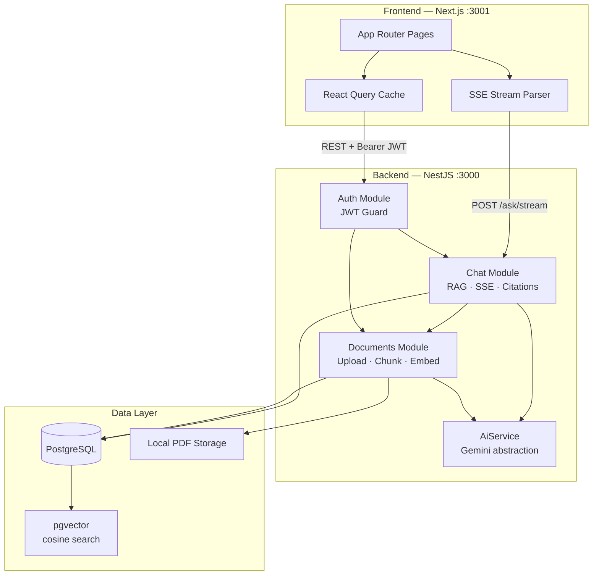
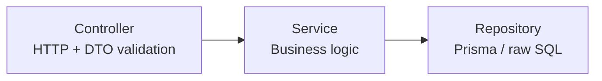
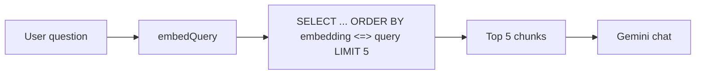
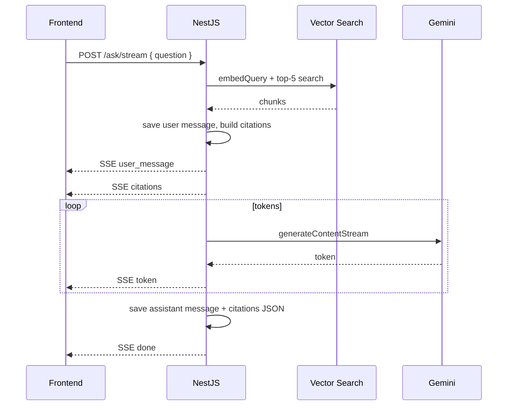
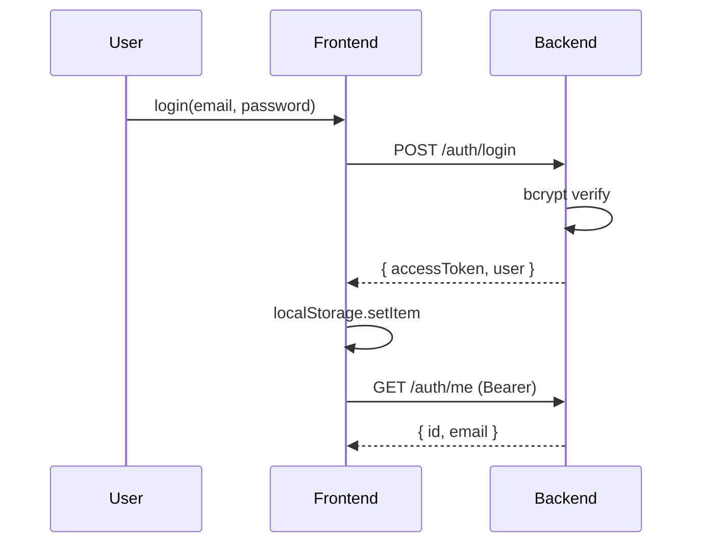
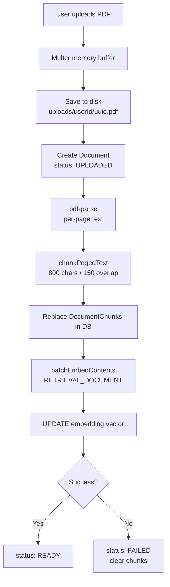
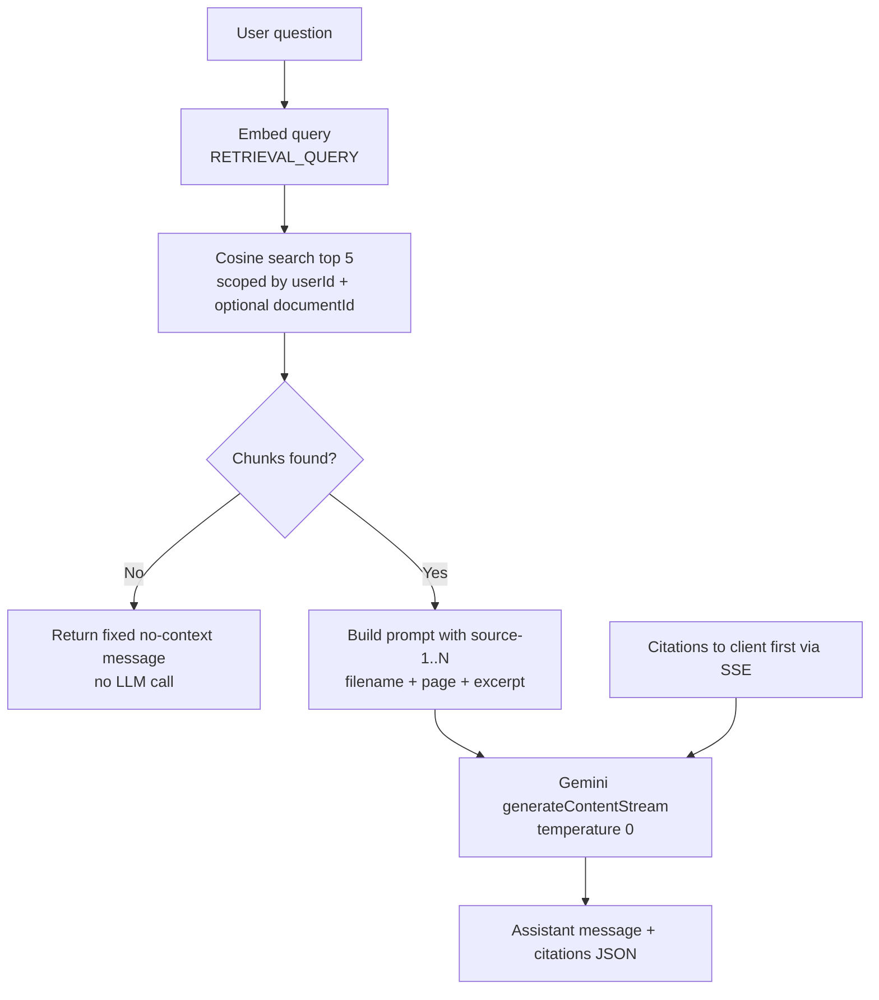
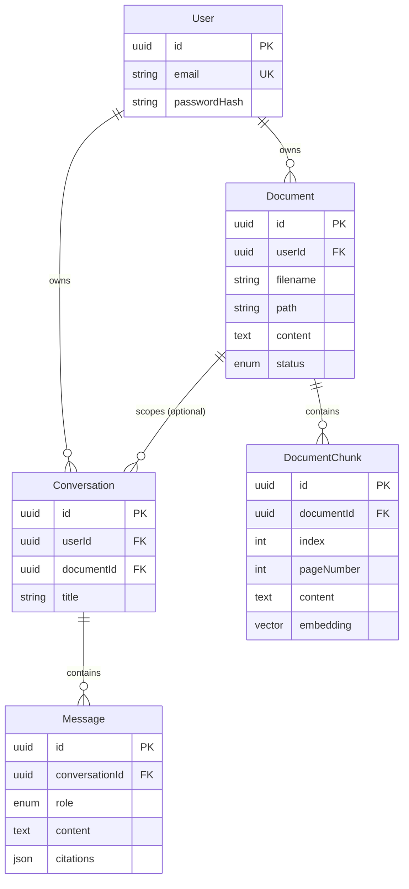
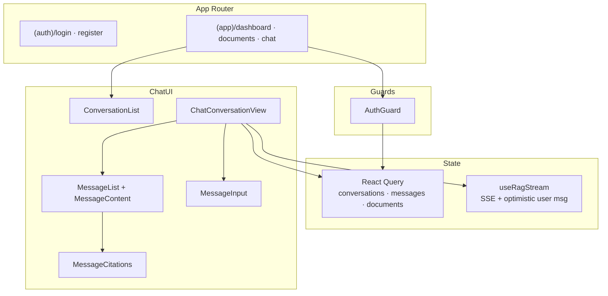

# AIChat

**AIChat** is a full-stack RAG (Retrieval-Augmented Generation) SaaS application. Users upload PDFs, ask questions in natural language, and receive grounded answers with **clickable source citations** — document name, page number, and excerpt.

Built as a production-style monorepo: **NestJS** API + **Next.js** frontend, **PostgreSQL + pgvector** for semantic search, and **Google Gemini** for embeddings and chat.

---

## Highlights

| Capability | Implementation |
|------------|----------------|
| Document Q&A | Top-5 cosine similarity over 1536-d embeddings |
| Grounded answers | Strict context-only prompt; refuses when evidence is missing |
| Streaming UX | Server-Sent Events (SSE) with live token + citation delivery |
| Citations | `[source-N]` in answers, expandable excerpts, document links |
| Multi-tenant isolation | All queries scoped by authenticated `userId` |
| Conversation history | Persisted threads with auto-titles from first question |

---

## Tech Stack

### Backend
| Layer | Choice | Version |
|-------|--------|---------|
| Runtime | Node.js | 20+ |
| Framework | NestJS | 11 |
| Language | TypeScript | 5.7 |
| ORM | Prisma | 7.8 |
| Database | PostgreSQL + **pgvector** | — |
| Auth | JWT (Passport) + bcrypt | 15m TTL |
| AI | Google Gemini API | `gemini-2.5-flash`, `gemini-embedding-001` |
| PDF | pdf-parse | Per-page text extraction |

### Frontend
| Layer | Choice | Version |
|-------|--------|---------|
| Framework | Next.js (App Router) | 16 |
| UI | React | 19 |
| Styling | Tailwind CSS 4 + shadcn-style components | — |
| Data | TanStack React Query | 5 |
| Icons | Lucide | — |

---

## System Architecture

High-level view of how the two applications interact:



### Layered backend design

NestJS modules follow **Controller → Service → Repository**:



| Module | Responsibility |
|--------|----------------|
| `AuthModule` | Register, login, JWT strategy, `/auth/me` |
| `DocumentsModule` | PDF upload, extraction, chunking, embedding, vector search |
| `ChatModule` | Conversations, messages, RAG orchestration, SSE streaming |
| `CommonModule` | Global config, Prisma, `AiService` |

---

## Architecture Decisions & Tradeoffs

### 1. RAG over fine-tuning

**Decision:** Retrieve relevant document chunks at query time and inject them into the prompt.

**Why:** No model training pipeline, instant updates when users upload new PDFs, answers traceable to source text.

**Tradeoff:** Quality depends on chunking and retrieval. Wrong chunks → wrong or incomplete answers. Mitigated by overlap, top-K retrieval, and a strict "no context → refuse" prompt.

---

### 2. pgvector in PostgreSQL (not a dedicated vector DB)

**Decision:** Store `vector(1536)` embeddings on `DocumentChunk` and query with cosine distance (`<=>`).

**Why:** Single database for users, documents, conversations, and vectors. Simpler ops, transactional consistency, no extra service.

**Tradeoff:** At very large scale (millions of chunks), dedicated vector stores (Pinecone, Qdrant) scale better. For a portfolio / SMB workload, pgvector is the pragmatic choice.



---

### 3. Fixed-size character chunking (800 / 150 overlap)

**Decision:** Split text into ~800-character windows with 150-character overlap, per PDF page.

**Why:** Simple, fast, no NLP dependencies. Overlap reduces boundary-splitting of sentences.

**Tradeoff:** Not semantic (paragraph/section aware). A table or list can span chunks awkwardly. Alternatives considered: recursive character splitters, sentence tokenizers, or LLM-based chunking — rejected for complexity and cost.

| Parameter | Value | Rationale |
|-----------|-------|-----------|
| Chunk size | 800 chars | Fits several sentences; stays under embedding context noise |
| Overlap | 150 chars | ~19% overlap preserves continuity at boundaries |
| Top K | 5 | Balance context window vs. noise |

---

### 4. Gemini embedding dimension truncation (3072 → 1536)

**Decision:** `gemini-embedding-001` returns up to 3072 dimensions; vectors are truncated to **1536** and L2-normalized before storage.

**Why:** Matches `vector(1536)` schema and keeps index size manageable.

**Tradeoff:** Some embedding quality may be lost vs. full dimensionality. Alternative: migrate schema to `vector(3072)` — rejected to keep pgvector index size and migration simple.

---

### 5. Separate embed tasks for documents vs. queries

**Decision:** `TaskType.RETRIEVAL_DOCUMENT` for chunks, `TaskType.RETRIEVAL_QUERY` for questions.

**Why:** Google's embedding models are trained for asymmetric retrieval — query and document vectors live in aligned but distinct spaces.

**Tradeoff:** Must always embed queries with the query task; mixing tasks hurts recall.

---

### 6. Temperature 0 for chat generation

**Decision:** `temperature: 0` on Gemini chat calls.

**Why:** Factual Q&A over fixed documents — minimize hallucination and answer variance.

**Tradeoff:** Less natural phrasing. Acceptable for a document assistant; creative writing would need higher temperature.

---

### 7. Strict grounding prompt + citation notation

**Decision:** System prompt forbids outside knowledge and requires `[source-N]` citations. If context is insufficient, return an exact fallback sentence.

**Why:** User trust and auditability. Citations map 1:1 to retrieved chunks.

**Tradeoff:** Model may still hallucinate occasionally; citations + stored chunk excerpts let users verify. No automated citation verification layer yet.

---

### 8. SSE streaming (not WebSockets)

**Decision:** RAG responses stream via **Server-Sent Events** on `POST /chat/conversations/:id/ask/stream`.

**Why:** One-way server→client fits token streaming. Works over HTTP, simpler than WebSockets, easy to parse in the browser.

**Tradeoff:** No bidirectional channel (cancel is client-side via `AbortController`). HTTP/1.1 connection limits can matter at extreme concurrency — HTTP/2 mitigates.



---

### 9. Citations persisted on assistant messages

**Decision:** `Message.citations` stored as JSON alongside assistant `content`.

**Why:** Conversation history shows sources without re-running retrieval. Streaming sends citations early; DB copy survives refresh.

**Tradeoff:** Citations are a snapshot at answer time. If documents are re-uploaded or re-embedded, old messages may reference stale chunk IDs. Re-retrieval on history view would be more accurate but costlier.

---

### 10. JWT in localStorage (no refresh token)

**Decision:** Short-lived access token (default **15m**) in `localStorage`, sent as `Authorization: Bearer`.

**Why:** Minimal auth complexity for a portfolio app. React Query refetches `/auth/me` when a token exists.

**Tradeoff:** XSS can exfiltrate tokens (mitigate with CSP in production). No silent refresh — users re-login after expiry. **HttpOnly cookies + refresh tokens** would be the production upgrade.



---

### 11. Per-user data isolation at the repository layer

**Decision:** Every document and conversation query filters by `userId` from JWT. Vector search JOINs `Document` to enforce ownership.

**Why:** Defense in depth — even if a chunk UUID leaks, another user cannot retrieve it.

**Tradeoff:** No shared/org workspaces yet. Would need tenant model and RBAC.

---

### 12. Optional document-scoped conversations

**Decision:** `Conversation.documentId` optionally limits vector search to one PDF.

**Why:** Focused Q&A when a user knows which file matters.

**Tradeoff:** Global conversations search all user documents — broader but noisier. UI does not yet expose document picker on create (API supports it).

---

### 13. Monorepo without workspace tooling

**Decision:** `backend/` and `frontend/` as sibling folders, separate `package.json` files, no Turborepo/Nx.

**Why:** Clear separation, independent deploy targets, low ceremony.

**Tradeoff:** Shared types duplicated (`RagCitation`, etc.). A shared `packages/types` package would reduce drift.

---

### 14. React Query for server state

**Decision:** TanStack Query with keyed caches (`conversations`, `messages`, `documents`).

**Why:** Automatic caching, deduplication, optimistic updates during SSE (append user message before stream completes).

**Tradeoff:** SSE streaming state lives outside Query (`useRagStream` local state) — intentional split between ephemeral stream and persisted history.

---

### 15. NestJS global ValidationPipe

**Decision:** `whitelist: true`, `forbidNonWhitelisted: true`, `transform: true` on all DTOs.

**Why:** Strip unknown fields, reject over-posting, coerce types — reduces injection and bad payloads.

**Tradeoff:** Stricter than many tutorials; clients must match DTO shape exactly.

---

## Document Ingestion Pipeline

End-to-end flow from PDF upload to searchable vectors:



| Step | Detail |
|------|--------|
| Max file size | 10 MB (configurable via `MAX_FILE_SIZE_MB`) |
| MIME check | `application/pdf` only |
| Embedding batch | 100 texts per Gemini API call |
| Failure handling | Document marked `FAILED`; chunks cleared |

---

## RAG Query Pipeline



### Citation object shape

```json
{
  "sourceIndex": 1,
  "sourceRef": "source-1",
  "chunkId": "uuid",
  "documentId": "uuid",
  "documentFilename": "report.pdf",
  "chunkIndex": 0,
  "pageNumber": 3,
  "similarity": 0.87,
  "excerpt": "…chunk text…"
}
```

Frontend renders sources under each assistant message; `[source-N]` in the answer body is clickable and highlights the matching source.

---

## Database Schema



**Enums:** `DocumentStatus` (`UPLOADED`, `READY`, `FAILED`), `MessageRole` (`USER`, `ASSISTANT`, `SYSTEM`).

**Indexes:** `userId` on documents/conversations; `documentId` on chunks; `conversationId` on messages; unique `(documentId, index)` on chunks.

---

## Frontend Architecture



| Route | Purpose |
|-------|---------|
| `/dashboard` | Workspace overview |
| `/documents` | PDF upload + file list |
| `/chat` | New conversation empty state |
| `/chat/[id]` | Active thread with streaming |

**UX patterns:** loading skeletons, empty states, error banners (only when no cached data), dark mode, smooth scroll, citation expand/collapse.

---

## API Reference

Base URL: `http://localhost:3000`  
Auth: `Authorization: Bearer <accessToken>` (except register/login)

### Auth
| Method | Path | Description |
|--------|------|-------------|
| POST | `/auth/register` | Create account |
| POST | `/auth/login` | Get JWT |
| GET | `/auth/me` | Current user |

### Documents
| Method | Path | Description |
|--------|------|-------------|
| POST | `/documents/upload` | Multipart PDF upload |
| GET | `/documents` | List user documents |
| POST | `/documents/search` | Debug vector search |

### Chat
| Method | Path | Description |
|--------|------|-------------|
| POST | `/chat/conversations` | Create thread |
| GET | `/chat/conversations` | List threads |
| GET | `/chat/conversations/:id` | Thread metadata |
| GET | `/chat/conversations/:id/messages` | Message history |
| POST | `/chat/conversations/:id/messages` | Add user message (non-RAG) |
| POST | `/chat/conversations/:id/ask` | RAG answer (JSON) |
| POST | `/chat/conversations/:id/ask/stream` | RAG answer (SSE) |

---

## Project Structure

```
AIChat/
├── backend/
│   ├── prisma/schema.prisma      # Models + pgvector extension
│   ├── src/
│   │   ├── main.ts               # Bootstrap, CORS, validation
│   │   ├── common/
│   │   │   ├── ai/ai.service.ts  # Gemini chat + embeddings
│   │   │   ├── database/         # PrismaService (global)
│   │   │   └── utils/chunk-text.ts
│   │   └── modules/
│   │       ├── auth/
│   │       ├── documents/        # PDF pipeline + vector search
│   │       └── chat/             # RAG, SSE, citations
│   └── .env.example
│
└── frontend/
    ├── src/
    │   ├── app/                  # Next.js App Router
    │   ├── components/           # chat, documents, layout, ui
    │   ├── hooks/                # use-chat, use-rag-stream, …
    │   └── lib/api/              # REST + SSE client
    └── .env.local.example
```

---

## Getting Started

### Prerequisites

- Node.js 20+
- PostgreSQL with **pgvector** extension (e.g. [Neon](https://neon.tech))
- Google AI API key ([Google AI Studio](https://aistudio.google.com/apikey))

### 1. Database

Enable pgvector on your PostgreSQL instance, then configure `DATABASE_URL`.

### 2. Backend

```bash
cd backend
cp .env.example .env
# Edit .env — set DATABASE_URL, JWT_SECRET, GEMINI_API_KEY

npm install
npx prisma db push --config prisma.config.ts
npm run start:dev
```

API runs at **http://localhost:3000**

### 3. Frontend

```bash
cd frontend
cp .env.local.example .env.local

npm install
npm run dev
```

App runs at **http://localhost:3001**

### Environment variables

**Backend (`backend/.env`)**

| Variable | Description |
|----------|-------------|
| `DATABASE_URL` | PostgreSQL connection string |
| `JWT_SECRET` | Signing secret (change in production) |
| `JWT_EXPIRES_IN` | Token TTL (default `15m`) |
| `GEMINI_API_KEY` | Google Generative AI key |
| `GEMINI_EMBEDDING_MODEL` | Default `gemini-embedding-001` |
| `GEMINI_CHAT_MODEL` | Default `gemini-2.5-flash` |
| `FRONTEND_URL` | CORS origin (default `http://localhost:3001`) |
| `UPLOAD_DIR` | PDF storage directory |
| `MAX_FILE_SIZE_MB` | Upload limit (default `10`) |

**Frontend (`frontend/.env.local`)**

| Variable | Description |
|----------|-------------|
| `NEXT_PUBLIC_API_URL` | Backend URL (default `http://localhost:3000`) |

---

## Future Improvements

| Area | Idea |
|------|------|
| Auth | Refresh tokens, HttpOnly cookies |
| Retrieval | Hybrid search (BM25 + vector), re-ranking, similarity threshold |
| Chunking | Semantic / recursive splitting |
| Scale | Background job queue for embedding, S3 for PDFs |
| Multi-tenant | Organizations, shared document libraries |
| Observability | Structured logging, tracing, embedding/chat cost metrics |
| Testing | E2E RAG evals with golden Q&A sets |

---

## License

Private / portfolio project — adjust as needed for your use case.
